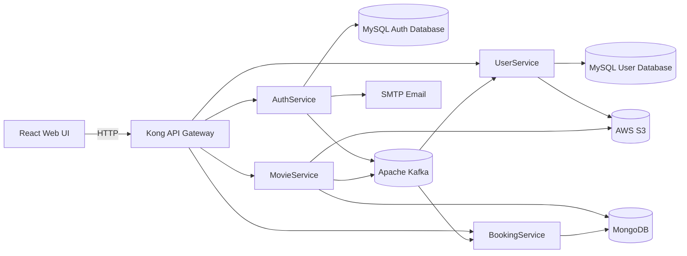

# CineBook

## Movie Ticket Booking Platform

CineBook is a full-stack movie ticket booking platform. Users can discover movies, explore theaters and showtimes, select seats, reserve tickets, confirm bookings, and manage their profiles. Administrators can manage movies, theaters, showtimes, pricing, and screen layouts from the web application.

Live demo: [cinebook-eta.vercel.app](https://cinebook-eta.vercel.app/)

## Features

### Customer experience

- Browse and search movies
- Filter movies by genre and language
- View movie details, theaters, and showtimes
- Select seats using an interactive seat layout
- Temporarily reserve seats before confirmation
- Confirm and view bookings
- Cancel bookings and release seats
- Manage profile information and profile images
- Refresh expired access sessions automatically

### Administration

- Create, update, and delete movies
- Upload movie posters and backdrops
- Manage theaters and amenities
- Create and manage showtimes
- Configure showtime prices and screen dimensions
- Configure premium seats and aisle positions
- Manage screen layouts and booked-seat data

## Architecture



The platform is composed of independently deployable services. Docker Compose uses the same port on the host and inside each application container:

| Component | Container port | Docker host port | Local address | Description |
| --- | ---: | ---: | --- | --- |
| `AuthService` | `9898` | `9898` | `http://localhost:9898` | Registration, OTP verification, login, JWT, and refresh tokens |
| `UserService` | `9810` | `9810` | `http://localhost:9810` | User profiles and profile-image storage |
| `MovieService` | `9820` | `9820` | `http://localhost:9820` | Movies, theaters, showtimes, and catalog administration |
| `BookingService` | `9830` | `9830` | `http://localhost:9830` | Seat layouts, reservations, and confirmed bookings |
| `UI` production container | `80` | `80` | `http://localhost` | Nginx-served React application |
| `UI` Vite development server | `5173` | `5173` | `http://localhost:5173` | Local frontend development server |
| Kong proxy | `8000` | `8000` | `http://localhost:8000` | HTTP API gateway used by the frontend |
| MySQL | `3306` | `3306` | `mysql://localhost:3306` | Authentication and profile data |
| MongoDB | `27017` | `27017` | `mongodb://localhost:27017` | Catalog and booking data |
| Kafka broker | `9092` | `9092` | `kafka://localhost:9092` | Inter-service event communication |

### Port access summary

- Use `http://localhost` for the Dockerized UI.
- Use `http://localhost:5173` for the Vite development UI.
- Use `http://localhost:8000` as the public HTTP API gateway.
- Use ports `9898`, `9810`, `9820`, and `9830` for direct backend service access.
- Use port `8001` for the Kong Admin API during local development.
- Use ports `3306`, `27017`, and `9092` for local database and messaging tools.
- Kafka port `9093` is internal to the Docker network and is not published to the host.

## Technology Stack

### Frontend

- React 19
- TypeScript
- Vite
- React Router
- Axios
- Tailwind CSS

### Backend

- Java 17
- Spring Boot
- Spring Security
- Spring Data JPA
- Spring Data MongoDB
- Spring Kafka
- Maven

### Infrastructure

- Docker and Docker Compose
- Kong Gateway
- MySQL 8
- MongoDB 6
- Apache Kafka
- AWS S3

## Application Flow

### Registration

1. The user submits a username, email, password, and role.
2. AuthService creates the account and sends an OTP by email.
3. The user verifies the OTP and provides profile details.
4. AuthService issues access and refresh tokens.
5. A profile event is published to Kafka.
6. UserService consumes the event and creates the user profile.

### Login

1. The UI sends credentials to AuthService through Kong.
2. AuthService authenticates the user.
3. AuthService returns an access token and refresh token.
4. The UI attaches the access token to subsequent API requests.
5. Kong routes authenticated requests to the appropriate service.

### Booking

1. The user selects a movie, theater, showtime, and seats.
2. BookingService creates a temporary reservation.
3. The reservation remains available for the configured reservation period.
4. The user confirms the reservation.
5. BookingService stores the confirmed booking and marks the seats as booked.
6. The booking is available in the user's profile.

## Authentication

AuthService issues JWT access tokens containing the authenticated username and roles. The UI stores the access and refresh tokens and automatically requests a new access token when an access token expires.

For authenticated downstream requests, Kong forwards user context using:

| Header | Description |
| --- | --- |
| `X-User-ID` | Authenticated user identifier |
| `X-User-Name` | Authenticated username |
| `X-User-Roles` | Comma-separated user roles |

## Frontend Routes

| Route | Page |
| --- | --- |
| `/` | Movie home page |
| `/movie/:id` | Movie details |
| `/movie/:id/seats` | Seat selection |
| `/booking/confirm` | Booking confirmation |
| `/booking/:bookingId` | Booking details |
| `/auth/login` | Login |
| `/auth/register` | Registration |
| `/auth/verify-otp` | OTP verification |
| `/profile` | User profile and bookings |
| `/admin` | Administration dashboard |

## API Overview

The public API is available through Kong at `http://localhost:8000`.

### Authentication

| Method | Endpoint | Description |
| --- | --- | --- |
| `POST` | `/auth/v1/signup` | Register a new account |
| `POST` | `/auth/v1/signup-otp-verify` | Verify registration OTP |
| `POST` | `/auth/v1/login` | Authenticate a user |
| `POST` | `/auth/v1/refreshToken` | Refresh an access token |
| `GET` | `/auth/v1/ping` | Get authenticated user context |

### User profiles

| Method | Endpoint | Description |
| --- | --- | --- |
| `GET` | `/user/v1/getUser` | Get the current profile |
| `POST` | `/user/v1/createUpdate` | Create or update the current profile |
| `POST` | `/user/v1/deleteUser` | Delete the current profile |

### Movies, theaters, and showtimes

| Method | Endpoint | Description |
| --- | --- | --- |
| `GET` | `/catalog/v1/movies` | List and filter movies |
| `GET` | `/catalog/v1/movies/{id}` | Get movie details |
| `GET` | `/catalog/v1/movies/search?q=...` | Search movies |
| `POST` | `/catalog/v1/movies` | Create a movie |
| `PUT` | `/catalog/v1/movies/{id}` | Update a movie |
| `DELETE` | `/catalog/v1/movies/{id}` | Delete a movie |
| `GET` | `/catalog/v1/theaters` | List theaters |
| `GET` | `/catalog/v1/theaters/{id}` | Get theater details |
| `POST` | `/catalog/v1/theaters` | Create a theater |
| `PUT` | `/catalog/v1/theaters/{id}` | Update a theater |
| `DELETE` | `/catalog/v1/theaters/{id}` | Delete a theater |
| `GET` | `/catalog/v1/movies/{movieId}/showtimes` | List movie showtimes |
| `GET` | `/catalog/v1/theaters/{theaterId}/showtimes` | List theater showtimes |
| `GET` | `/catalog/v1/showtimes/{id}` | Get showtime details |
| `POST` | `/catalog/v1/showtimes` | Create a showtime |
| `PUT` | `/catalog/v1/showtimes/{id}` | Update a showtime |
| `DELETE` | `/catalog/v1/showtimes/{id}` | Delete a showtime |

### Bookings and seats

| Method | Endpoint | Description |
| --- | --- | --- |
| `GET` | `/bookings/movies/{movieId}/screens/{screenId}/seats` | Get a seat map |
| `GET` | `/bookings/movies/{movieId}/screens/{screenId}/slots` | Get screen slots |
| `POST` | `/bookings/reservations` | Reserve seats |
| `DELETE` | `/bookings/reservations/{id}` | Cancel a reservation |
| `POST` | `/bookings/confirm` | Confirm a booking |
| `GET` | `/bookings/user/me` | Get the current user's bookings |
| `GET` | `/bookings/{bookingId}` | Get booking details |
| `DELETE` | `/bookings/{bookingId}` | Cancel a booking |
| `POST` | `/bookings/screens` | Create a screen layout |
| `PUT` | `/bookings/screens/{id}` | Update a screen layout |
| `PATCH` | `/bookings/screens/{id}/booked-seats` | Update booked seats |

## Repository Structure

```text
AuthService/              Authentication microservice
UserService/              User profile microservice
MovieService/             Movie catalog microservice
BookingService/            Reservation and booking microservice
UI/                       React frontend
Kong/                     API gateway configuration
docker-compose.yml        Application containers
dependencies-compose.yml MySQL, MongoDB, and Kafka containers
init.sql                  Database initialization script
architecture/             Architecture documentation
```

## Configuration

Create a local `.env` file for Docker Compose. The main configuration values are:

| Variable | Purpose |
| --- | --- |
| `MYSQL_HOST` | MySQL hostname |
| `MYSQL_PORT` | MySQL port |
| `MYSQL_AUTH_DB` | AuthService database name |
| `MYSQL_USER_DB` | UserService database name |
| `MYSQL_USER` | MySQL username |
| `MYSQL_PASSWORD` | MySQL password |
| `MONGO_URL` | MongoDB connection string |
| `KAFKA_HOST` | Kafka hostname |
| `KAFKA_PORT` | Kafka port |
| `EMAIL` | SMTP account for OTP messages |
| `EMAIL_PASSWORD` | SMTP account password |
| `AWS_DEFAULT_REGION` | AWS region |
| `AWS_ACCESS_KEY_ID` | AWS access key |
| `AWS_SECRET_ACCESS_KEY` | AWS secret key |
| `AWS_S3_BUCKET_NAME` | S3 bucket name |
| `VITE_API_BASE_URL` | Frontend API base URL |
| `CORS_ALLOWED_ORIGINS` | Allowed frontend origins |

## Run with Docker

### Requirements

- Docker Desktop
- Docker Compose
- A configured local `.env` file

Start the infrastructure and application services:

```powershell
docker compose -p cinebook -f dependencies-compose.yml -f docker-compose.yml up --build -d
```

Open the application at:

```text
http://localhost
```

The gateway is available at:

```text
http://localhost:8000
```

View running containers:

```powershell
docker compose -p cinebook -f dependencies-compose.yml -f docker-compose.yml ps
```

View logs:

```powershell
docker compose -p cinebook -f dependencies-compose.yml -f docker-compose.yml logs -f
```

Stop the application:

```powershell
docker compose -p cinebook -f dependencies-compose.yml -f docker-compose.yml down
```

## Run Locally

Start infrastructure services:

```powershell
docker compose -p cinebook -f dependencies-compose.yml up -d
```

Run each backend service from its directory:

```powershell
cd AuthService
.\mvnw.cmd spring-boot:run
```

```powershell
cd UserService
.\mvnw.cmd spring-boot:run
```

```powershell
cd MovieService
.\mvnw.cmd spring-boot:run
```

```powershell
cd BookingService
.\mvnw.cmd spring-boot:run
```

Run the frontend:

```powershell
cd UI
yarn install
yarn dev
```

The development UI is available at `http://localhost:5173`.

## Health Checks

| Service | Endpoint |
| --- | --- |
| AuthService | `http://localhost:9898/health` |
| UserService | `http://localhost:9810/health` |
| MovieService | `http://localhost:9820/health` |
| BookingService | `http://localhost:9830/health` |
| Kong | `http://localhost:8000/status` |

## Build Commands

Build a backend service:

```powershell
cd AuthService
.\mvnw.cmd clean package
```

Build the frontend:

```powershell
cd UI
yarn build
```

## License

This project is licensed under the [MIT License](LICENSE).
